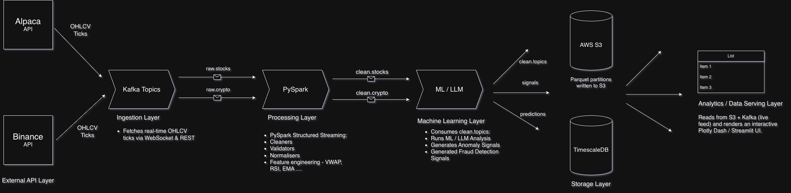

# MarketStream — Real-Time Stock & Crypto Price Intelligence Platform

A production-grade, end-to-end pipeline for streaming, processing, predicting,
and visualising live market data .

---

## Architecture Overview




```
External APIs (Alpaca / Binance / Polygon)
        │
        ▼
 ┌─────────────┐
 │   Ingestion  │  Fetches OHLCV ticks via WebSocket / REST
 │   (ingest/)  │
 └──────┬──────┘
        │ Kafka Topics: raw.stocks  /  raw.crypto
        ▼
 ┌─────────────┐
 │  Processing  │  PySpark Structured Streaming — cleans, validates,
 │  (process/)  │  normalises, engineers features (VWAP, RSI, EMA…)
 └──────┬──────┘
        │ Kafka Topics: clean.stocks  /  clean.crypto
        ▼
 ┌─────────────┐
 │     AI       │  Consumes clean topics, runs ML / LLM analysis,
 │    (ai/)     │  generates price predictions and sentiment signals
 └──────┬──────┘
        │
        ▼
 ┌─────────────┐
 │   Storage    │  Writes Parquet partitions to AWS S3.
 │ (storage/)   │  Maintains a lightweight SQLite metadata cache.
 └──────┬──────┘
        │
        ▼
 ┌─────────────┐
 │  Dashboard   │  Reads from S3 + Kafka (live feed) and renders
 │(dashboard/)  │  an interactive Plotly Dash / Streamlit UI.
 └─────────────┘
```

---

## Module Connections

| From            | To              | Transport                     | Data                        |
|-----------------|-----------------|-------------------------------|-----------------------------|
| External APIs   | Ingestion       | HTTP / WebSocket              | Raw tick (OHLCV + metadata) |
| Ingestion       | Kafka           | kafka-python producer         | JSON message per tick       |
| Kafka           | Processing      | PySpark readStream            | raw.stocks / raw.crypto     |
| Processing      | Kafka           | PySpark writeStream           | clean.stocks / clean.crypto |
| Processing      | S3              | spark.write (Parquet)         | Cleaned OHLCV partitions    |
| Kafka (clean)   | AI              | kafka-python consumer         | Normalised feature vectors  |
| AI              | S3              | boto3                         | Predictions + signals JSON  |
| S3              | Dashboard       | boto3 / awswrangler           | Historical Parquet reads    |
| Kafka (clean)   | Dashboard       | kafka-python consumer         | Live price feed             |
| AI              | Dashboard       | Shared S3 predictions prefix  | Prediction overlay data     |

---

## Getting Started on EC2

### 1. Prerequisites

```bash
sudo apt update && sudo apt install -y python3.11 python3-pip openjdk-17-jdk
pip install -r requirements.txt
```

### 2. Start Kafka + Zookeeper

```bash
cd infra/
docker-compose up -d          # spins up Kafka + Zookeeper + Schema Registry
```

### 3. Create Kafka Topics

```bash
bash infra/scripts/create_topics.sh
```

### 4. Configure Environment

```bash
cp .env.example .env
# Fill in: API keys, AWS credentials, S3 bucket name, Kafka broker address
```

### 5. Run the Pipeline (in order)

```bash
# Terminal 1 — start ingestion producers
python ingest/run_producers.py

# Terminal 2 — start PySpark processing
spark-submit process/spark_stream.py

# Terminal 3 — start AI consumer
python ai/run_ai_pipeline.py

# Terminal 4 — start storage writer
python storage/s3_writer.py

# Terminal 5 — launch dashboard
python dashboard/app.py
```

Or use the supervisor config to manage all processes automatically:

```bash
supervisord -c infra/supervisord.conf
```

---

## Data Schema (per message / OHLCV tick)

```json
{
  "symbol":    "AAPL",
  "market":    "stock",
  "timestamp": "2024-11-01T14:32:00Z",
  "open":      182.34,
  "high":      183.10,
  "low":       181.90,
  "close":     182.75,
  "price":     182.75,
  "volume":    1_204_300
}
```

---

## Environment Variables (.env)

| Variable              | Description                            |
|-----------------------|----------------------------------------|
| `ALPACA_API_KEY`      | Alpaca Markets API key                 |
| `ALPACA_SECRET_KEY`   | Alpaca Markets secret                  |
| `BINANCE_API_KEY`     | Binance WebSocket API key              |
| `POLYGON_API_KEY`     | Polygon.io API key (backup feed)       |
| `KAFKA_BROKER`        | Kafka broker address (default localhost:9092) |
| `AWS_ACCESS_KEY_ID`   | AWS IAM key                            |
| `AWS_SECRET_ACCESS_KEY` | AWS IAM secret                       |
| `S3_BUCKET`           | Target S3 bucket name                  |
| `OPENAI_API_KEY`      | OpenAI key (for LLM sentiment analysis)|

---

## S3 Partition Layout

```
s3://<bucket>/
  market-data/
    stocks/
      year=2024/month=11/day=01/
        part-00000.parquet
    crypto/
      year=2024/month=11/day=01/
        part-00000.parquet
  predictions/
    stocks/AAPL/2024-11-01.json
    crypto/BTC-USD/2024-11-01.json
```

---

## Tech Stack

| Layer       | Technology                                   |
|-------------|----------------------------------------------|
| Ingestion   | Python, kafka-python, websocket-client        |
| Streaming   | Apache Kafka 3.x, Zookeeper                  |
| Processing  | PySpark 3.5 Structured Streaming              |
| AI / ML     | scikit-learn, Prophet, LangChain + OpenAI    |
| Storage     | AWS S3 (Parquet), SQLite (metadata cache)    |
| Dashboard   | Plotly Dash (or Streamlit), Pandas, Boto3    |
| Infra       | Docker Compose, Supervisor, AWS EC2 (Ubuntu) |
